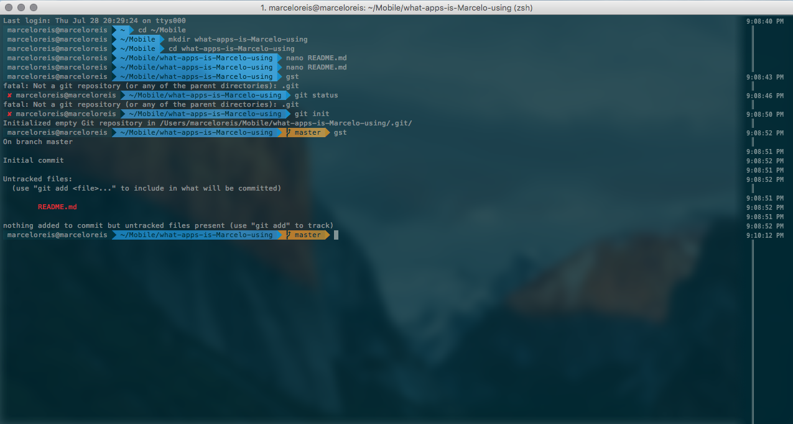

# What apps is Marcelo Reis using

here is some information about the setup I'm currently using.

## Terminal
* I use [iTerm2](https://www.iterm2.com/) instead of the stock terminal Mac app
* I use [oh-my-zshell](https://github.com/robbyrussell/oh-my-zsh)
* I use [Solarized Dark](http://ethanschoonover.com/solarized) for the terminal colors
* I use the [Meslo Powerline Font](https://github.com/powerline/fonts/blob/master/Meslo/Meslo%20LG%20M%20DZ%20Regular%20for%20Powerline.otf) as you need a font that supports the directory characters for `powerline`
* The results:

## Xcode
* I use [asset catalog creator](https://itunes.apple.com/br/app/asset-catalog-creator-free/id866571115?l=en&mt=12) for take images and create a full set of icons
* I use [Swift-Clean](http://www.swiftcleanapp.com/) to help me set a standard for writing clean Swift.

## Menssegers
* [Slack](https://itunes.apple.com/br/app/slack/id803453959?l=en&mt=12) to brings all my communication together in one place.
* [Telegram](https://itunes.apple.com/br/app/telegram-desktop/id946399090?l=en&mt=12) because i'm not a end user =)
